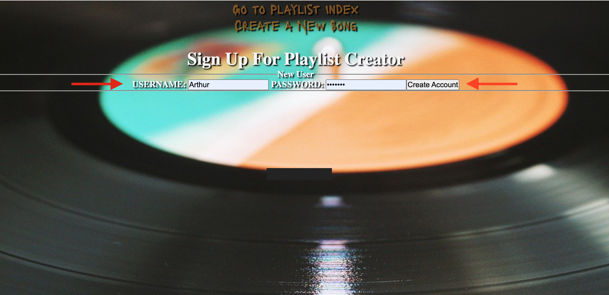

# Playlist Creator
### An app that lets you create a playlist that seperates songs the user favors and songs that are non favored. User is able to add and delete songs, as well as edit the title, artist and image.

#### The tools used to make this app were:
- JavaScript
- Css
- HTML
- JSX
- MongoDB
- Express

## Trello Board/ ERD
https://trello.com/b/GmbhtTa0/playlist#

## Basic Instructions to make App work

* Navigate to the home page link: http://localhost:3003/playlists

* The page will have you sign up before creaating a playlist( Create a username and password )

* Click on "Create A New Song"

* Follow the prompt, enter title of the song, enter artist of the song and an extra feature (add album cover to song, copy image address and drop into image box)

* Once you song is created you can view the song you added with the album image.

* You can also view the favorite songs and non favored songs on index page.

* Navigate through the links to get to diffrent pages.

## Wireframes

