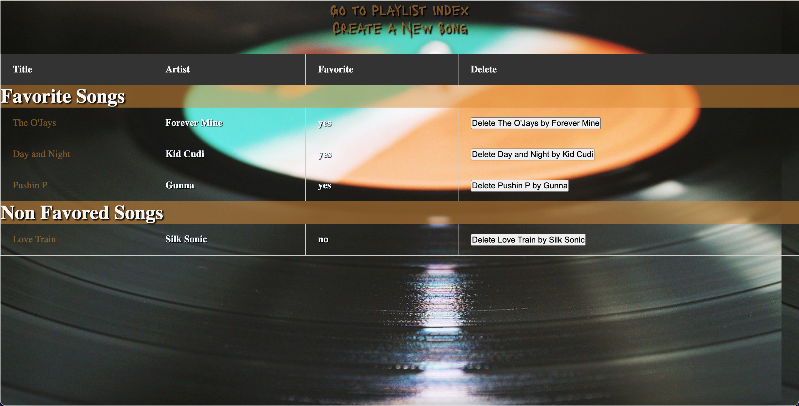
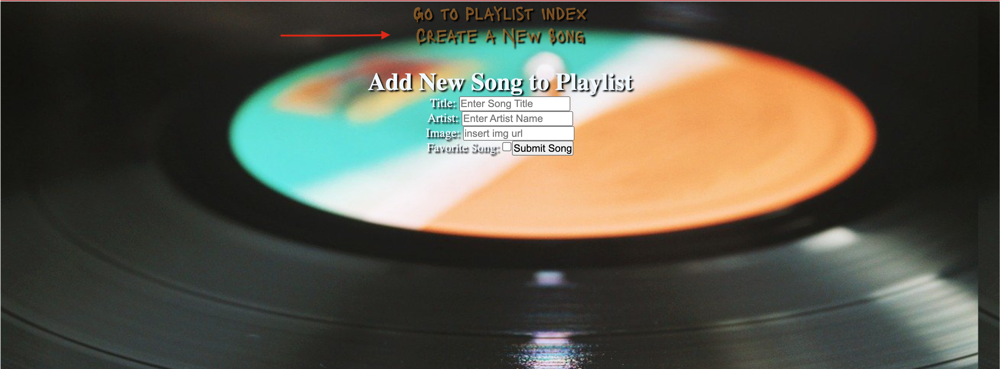

# Create a Playlist

### An app that lets you build a playlist that seperaates song you listen too and song that are favorites.

#### The features used to make this app work were:
- JavaScript
- Css
- HTML
- JSX
- MongoDB

## Basic Instructions to make App work

* Navigate to the home page link: http://localhost:3003/playlists

* Click on "Create A New Song"

* Follow the prompt, enter title of the song, enter artist of the song and an extra feature add album cover to song, copy image address and drop into image box
then press submit

* Once you song is created you can view the song you added with the album image.

* You can also view the favorite songs and non favored songs on index page.

* Navigate through the links to get to diffrent pages.
